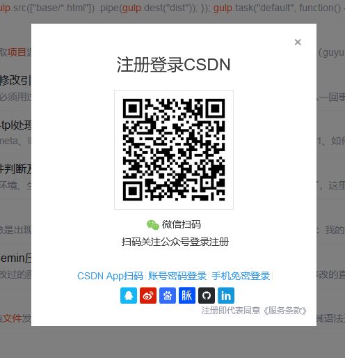

# F_CK CSDN

Chrome 扩展，去除某站的强制登录提示。

## 安装/使用

1. 将代码下载到本地
2. 打开 Chrome，地址栏输入 `chrome://extensions/` 进入到扩展程序页面
3. 开启开发者模式（页面右上角）
4. 点击左上角“加载已解压的扩展程序”，选择第 1 步下载的 `src` 目录

## License

[MIT](http://opensource.org/licenses/MIT)
